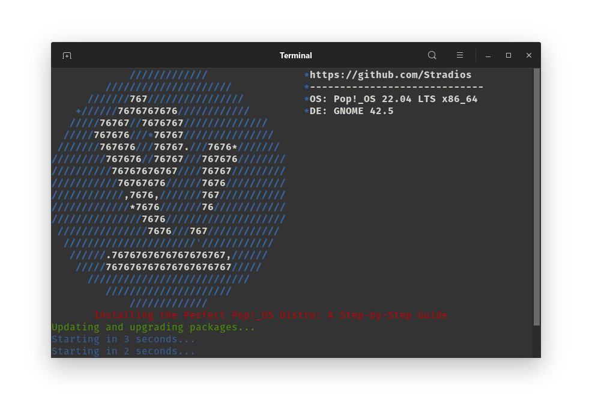
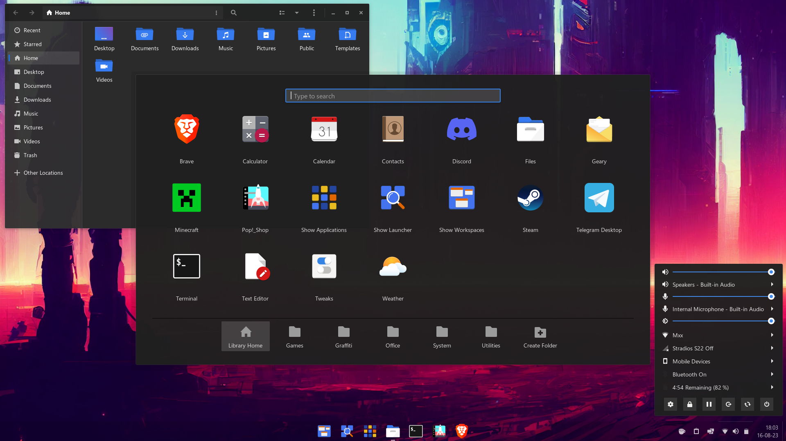
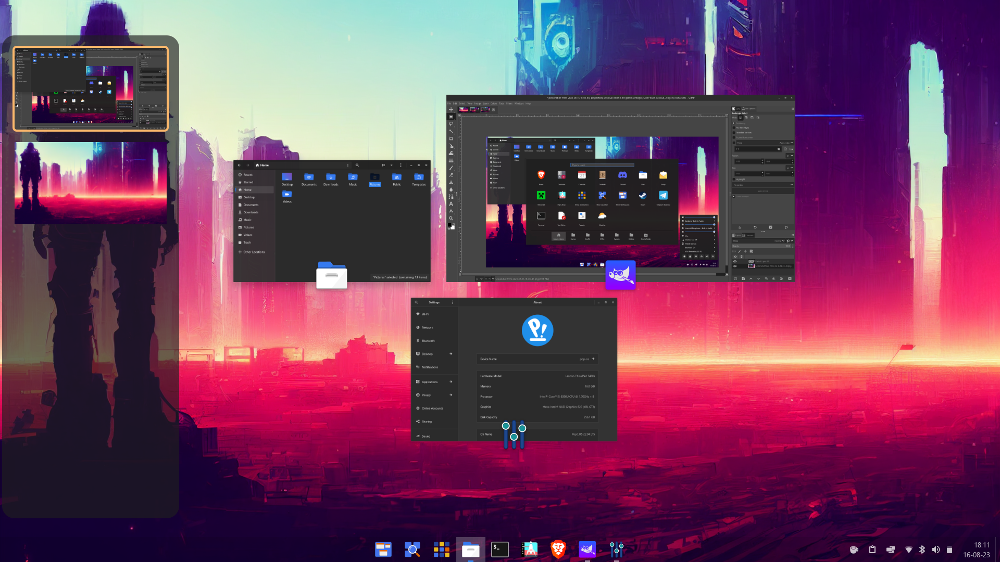
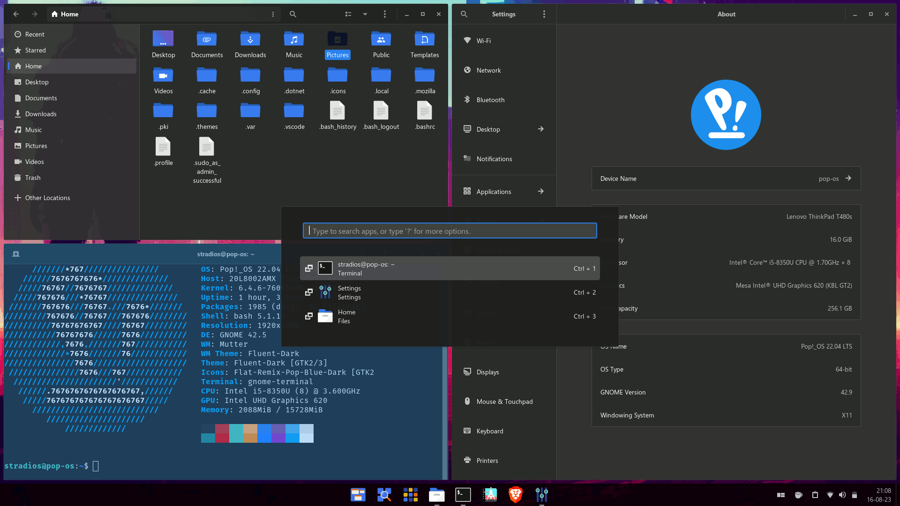

# One Pop Install all you need

# One pop os script for fast install of all you need for this look.

    cd Downloads/
    git clone https://github.com/Stradios/one_pop_install_all_you_need.git
    cd one_pop_install_all_you_need/
    chmod +x install-me.sh
    ./install-me.sh

* Update and upgrade packages
* Install Ubuntu restricted extras
* <a href="https://github.com/uunicorn/python-validity">open-fprintd for suported fprintd </a> from https://github.com/uunicorn
* Configure PAM authentication
* <a href="https://desktop.telegram.org/">Install Telegram Desktop</a> 
* <a href="https://brave.com/linux/">Run Brave installation script</a>
* Install GNOME Tweaks
* <a href="https://github.com/vinceliuice/Fluent-gtk-theme">Fluent GTK theme installation script</a>
* Install Yaru themes
* <a href="https://desktop.telegram.org/">Run Pop Cosmic Applications Yaru Colors script</a> From https://github.com/Stradios
* <a href="https://github.com/mrbvrz/segoe-ui-linux">Run Segoe UI Linux installation script</a> From https://github.com/mrbvrz
* Install Extension Manager via Flatpak 
* Edit GDM custom configuration
* 

 
